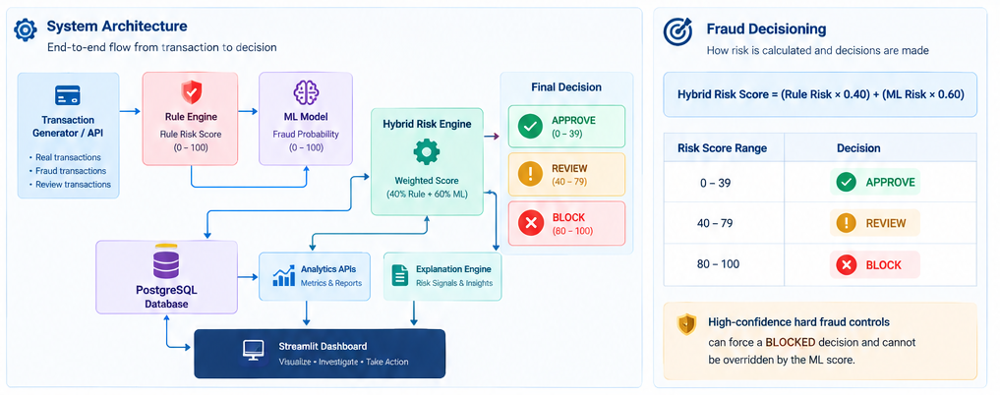
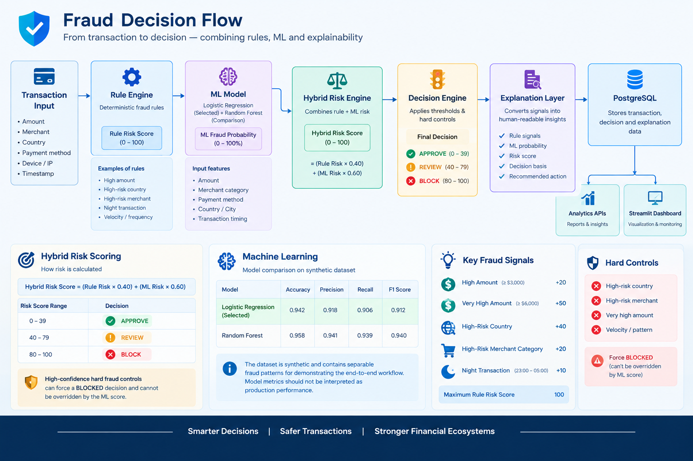

# 🛡️ FraudShield AI
### Real-Time Payment Fraud Detection Platform

> **Detect → Decide → Explain → Investigate**
>
> An end-to-end payment fraud detection prototype combining **deterministic fraud rules, machine learning, hybrid risk scoring, explainable decisions, REST APIs, PostgreSQL, and an operational analytics dashboard.**

<p align="center">


</p>

---


## ⚡ At a Glance

|---|---|
| 🎯 **Problem** | Identify potentially fraudulent payment transactions while balancing automated decisions with manual review |
| 🧠 **Approach** | Rule Engine + Machine Learning + Hybrid Risk Aggregation |
| 📊 **Decision** | `APPROVED` · `REVIEW` · `BLOCKED` |
| 🔍 **Explainability** | Rule signals + ML probability + human-readable decision explanation |
| 🗄️ **Persistence** | PostgreSQL |
| 🚀 **Backend** | FastAPI REST APIs |
| 📈 **Dashboard** | Streamlit + Plotly |
| 🧪 **Dataset** | Synthetic payment transaction dataset |
| 🏗️ **Status** | **v1.0 End-to-End Prototype** |

---

# 🎯 What is FraudShield AI?

FraudShield AI is an **end-to-end payment fraud detection prototype** designed to demonstrate how a fraud decisioning product can combine:

- 🛡️ Deterministic fraud rules
- 🤖 Machine learning risk prediction
- ⚖️ Hybrid risk aggregation
- 🚨 Automated fraud decisions
- 🔎 Decision explainability
- 🗄️ Transaction persistence
- 📊 Fraud analytics
- 🌐 REST APIs
- 🖥️ Operational monitoring

The goal is not simply to build a fraud model.

The goal is to demonstrate the **complete journey from transaction → risk assessment → decision → explanation → analytics**.

---

# 👀 30-Second Product View

```text
                 PAYMENT TRANSACTION
                         │
                         ▼
              ┌─────────────────────┐
              │ Transaction API     │
              │ / Generator         │
              └──────────┬──────────┘
                         │
              ┌──────────┴──────────┐
              ▼                     ▼
       ┌─────────────┐       ┌─────────────┐
       │ Rule Engine │       │  ML Model   │
       │             │       │             │
       │ Risk 0-100  │       │ Fraud Prob. │
       └──────┬──────┘       └──────┬──────┘
              │                     │
              └──────────┬──────────┘
                         ▼
              ┌─────────────────────┐
              │ Hybrid Risk Engine  │
              │ 40% Rules + 60% ML  │
              └──────────┬──────────┘
                         │
                         ▼
                ┌─────────────────┐
                │ Final Risk Score│
                │     0 - 100     │
                └────────┬────────┘
                         │
             ┌───────────┼───────────┐
             ▼           ▼           ▼
         🟢 APPROVE   🟠 REVIEW   🔴 BLOCK
             │           │           │
             └───────────┼───────────┘
                         ▼
                  PostgreSQL
                         │
              ┌──────────┴──────────┐
              ▼                     ▼
       Analytics APIs        Explanation Layer
              │                     │
              └──────────┬──────────┘
                         ▼
                  📊 Dashboard
```

---

# 🏗️ System Architecture

### End-to-end architecture



> **Architecture principle:** separate deterministic business controls, predictive scoring, decision aggregation, persistence, analytics, and explanation.

### 🔎 Architecture Components

| Component | Responsibility |
|---|---|
| 💳 Transaction Generator | Creates realistic normal, suspicious, fraud, and review transactions |
| 🌐 FastAPI | Exposes transaction and analytics REST APIs |
| 🛡️ Rule Engine | Applies deterministic fraud rules |
| 🤖 ML Model | Estimates fraud probability |
| ⚖️ Hybrid Risk Engine | Combines rule risk and ML risk |
| 🚨 Decision Engine | Produces APPROVED / REVIEW / BLOCKED |
| 🗄️ PostgreSQL | Persists transaction and decision data |
| 📊 Analytics Service | Provides risk, country, merchant and transaction analytics |
| 🔎 Explanation Layer | Converts decision signals into human-readable insights |
| 🖥️ Streamlit Dashboard | Visualizes operational fraud intelligence |

---

# 🚦 Fraud Decisioning

The core product decision is based on a **hybrid risk score** rather than relying exclusively on rules or machine learning.

### Hybrid Risk Formula

```text
Hybrid Risk Score
      =
(Rule Risk × 0.40)
      +
(ML Risk × 0.60)
```

Where:

```text
Rule Risk = deterministic fraud-rule score

ML Risk = ML fraud probability × 100
```

### Decision Thresholds

| Risk Score | Decision | Meaning |
|---:|:---:|---|
| 🟢 **0–39** | `APPROVED` | Low overall risk |
| 🟠 **40–79** | `REVIEW` | Requires additional review |
| 🔴 **80–100** | `BLOCKED` | High-confidence fraud risk |



### 🛡️ Hard Fraud Controls

Certain high-confidence rule conditions can force a:

```text
🔴 BLOCKED
```

decision.

These controls **cannot be overridden by the ML score**.

This reflects an important fraud-product principle:

> Predictive models can support a decision, but high-confidence business controls may still act as mandatory safeguards.

---

# 🧠 Rule-Based Fraud Detection

The current rule engine evaluates multiple transaction signals.

| Signal | Risk Contribution |
|---|---:|
| 💰 High Amount | +20 |
| 💰 Very High Amount | +50 |
| 🌍 High-Risk Country | +40 |
| 🛍️ High-Risk Merchant Category | +20 |
| 🌙 Night Transaction | +10 |
| 🧮 Maximum Score | 100 |

### Current thresholds

```text
High Amount       ≥ $3,000
Very High Amount  ≥ $6,000

Night Transaction
23:00 → 05:00

Review
40+

Block
80+
```

The rules are intentionally configurable through the project configuration rather than being hard-coded into the API layer.

---

# 🤖 Machine Learning

FraudShield AI compares two traditional machine-learning approaches for the synthetic payment dataset:

| Model | Purpose |
|---|---|
| Logistic Regression | Selected inference model |
| Random Forest | Model comparison |

The feature pipeline includes transaction attributes such as:

- 💰 Amount
- 🛍️ Merchant category
- 💳 Payment method
- 🌍 Country
- 🏙️ City
- 🕐 Transaction timing

### Model selection

Logistic Regression and Random Forest were evaluated during model training.

The current implementation uses:

> **Logistic Regression for inference**

The model artifact is stored locally and loaded by the prediction layer.

---

## ⚠️ Important ML Dataset Note

The dataset is **synthetic** and intentionally contains patterns that make fraud distinguishable for demonstrating the complete product workflow.

Therefore:

> **The reported model metrics should not be interpreted as production fraud-detection performance.**

This project demonstrates the **engineering and product decisioning workflow**, not a production-trained fraud model.

---

# 🔎 Explainable Fraud Decisions

A fraud system should not only answer:

> "What is the risk score?"

It should also answer:

> **"Why did the system make this decision?"**

FraudShield AI therefore generates structured decision explanations containing:

- 🧮 Final risk score
- 🚦 Final decision
- 🛡️ Rule signals
- 🤖 ML fraud probability
- 📌 Decision basis
- 📝 Natural-language insight
- 🎯 Recommended action


### Example

```json
{
  "headline": "High Fraud Risk",
  "risk_level": "HIGH",
  "summary": "Transaction blocked due to high fraud risk.",
  "key_signals": [
    "Very High Amount",
    "High Risk Country",
    "High Risk Merchant",
    "ML model indicates elevated fraud probability"
  ],
  "decision_basis": "Deterministic block rule triggered.",
  "final_risk_score": 100,
  "final_decision": "BLOCKED"
}
```

### Important implementation detail

The current explanation layer is **deterministic**.

It does not currently depend on an external LLM such as:

- Ollama
- Qwen
- OpenAI API
- LangChain

The explanation layer converts available fraud signals into structured, human-readable insights.

---

# 📊 Operational Dashboard

FraudShield AI includes an operational Streamlit dashboard designed around three common workflows:

### 📈 Dashboard

Provides:

- Transaction volume
- Approved / Review / Blocked distribution
- Risk trends
- Country analytics
- Merchant-category analytics
- High-risk transaction insights

### 💳 Transactions

Provides:

- Transaction search
- Risk filtering
- Decision filtering
- Transaction-level details
- Fraud signals
- AI-assisted decision explanation

### 🚨 Alerts

Provides:

- High-risk transaction monitoring
- Alert prioritization
- Risk signals
- Direct navigation to transaction details


---

# 🎬 Product Demo

> **Interactive demo:** transaction generation → fraud scoring → decision → explanation → dashboard.

<p align="center">
  
</p>

### Demo flow

```text
Generate Transaction
        ↓
Evaluate Rules
        ↓
Run ML Prediction
        ↓
Calculate Hybrid Risk
        ↓
APPROVE / REVIEW / BLOCK
        ↓
Persist to PostgreSQL
        ↓
Generate Explanation
        ↓
View in Dashboard
```

---

# 🌐 REST API

FraudShield AI exposes REST APIs through FastAPI.

### Core Transaction APIs

| Method | Endpoint | Purpose |
|:---:|---|---|
| `POST` | `/transactions/generate` | Generate one transaction |
| `POST` | `/transactions/generate/{count}` | Generate multiple transactions |
| `POST` | `/transactions/generate/fraud` | Generate a fraud transaction |
| `POST` | `/transactions/generate/fraud/{count}` | Generate multiple fraud transactions |
| `POST` | `/transactions/generate/review` | Generate a review transaction |
| `POST` | `/transactions/generate/review/{count}` | Generate multiple review transactions |
| `GET` | `/transactions/` | Retrieve transactions |
| `GET` | `/transactions/{transaction_id}` | Retrieve transaction details and explanation |
| `GET` | `/transactions/stats` | Transaction statistics |

### Analytics APIs

| Method | Endpoint | Purpose |
|:---:|---|---|
| `GET` | `/transactions/analytics/risk-distribution` | Risk distribution |
| `GET` | `/transactions/analytics/countries` | Country-level analytics |
| `GET` | `/transactions/analytics/merchant-categories` | Merchant category analytics |
| `GET` | `/transactions/analytics/high-risk` | High-risk transaction monitoring |

### API Documentation

Once the FastAPI service is running:

```text
http://127.0.0.1:8000/docs
```

FastAPI automatically provides interactive Swagger/OpenAPI documentation.


---

# 🧪 Transaction Generation

The simulator supports different transaction profiles.

| Profile | Purpose |
|---|---|
| 🟢 Normal | Represents typical payment activity |
| 🟠 Suspicious | Represents borderline transaction behaviour |
| 🔴 Fraud | Creates high-risk fraud scenarios |
| 🟡 Review | Intentionally generates transactions targeting the REVIEW range |

The review generator is particularly useful for demonstrating the complete manual-review workflow without artificially changing stored transaction decisions.

---

# 🗄️ Data & Persistence

PostgreSQL is used to persist transaction information including:

- Transaction ID
- Customer ID
- Merchant
- Merchant category
- Amount
- Currency
- Payment method
- Country
- City
- Device information
- IP address
- Risk score
- Fraud status
- Transaction timestamp
- Audit timestamps

The database provides the persistence layer for both operational transaction workflows and dashboard analytics.

---

# 🧰 Technology Stack

| Layer | Technology |
|---|---|
| 🐍 Language | Python 3.13 |
| 🌐 API | FastAPI |
| 🗄️ Database | PostgreSQL |
| 🧮 ORM | SQLAlchemy |
| 🔄 Database Migration | Alembic |
| 🤖 Machine Learning | scikit-learn |
| 📊 Data Processing | pandas |
| 🔢 Numerical Processing | NumPy |
| 📈 Visualization | Plotly |
| 🖥️ Dashboard | Streamlit |
| 🧪 Testing | Pytest |
| 📦 Version Control | Git / GitHub |

---

# 📁 Project Structure

```text
FraudShield-AI/
│
├── app/
│   ├── api/
│   ├── database/
│   ├── models/
│   └── services/
│       ├── ml/
│       ├── rule_engine.py
│       ├── transaction_generator.py
│       └── transaction_service.py
│
├── configs/
│   └── rules.py
│
├── datasets/
│   ├── raw/
│   └── processed/
│
├── artifacts/
│   └── fraud_model.joblib
│
├── docs/
│   ├── images/
│   └── demo/
│
├── tests/
│
├── requirements.txt
├── README.md
└── .gitignore
```

---

# 🎯 Key Product Decisions

The project intentionally focuses on **product-level fraud decisioning**, rather than simply building an ML model.

| Decision | Why |
|---|---|
| 🛡️ Rule Engine + ML | Combines deterministic business controls with predictive risk scoring |
| ⚖️ 40% Rules + 60% ML | Balances explicit fraud signals with model-based probability |
| 🚨 Hard fraud controls | Prevents high-confidence rule signals from being overridden |
| 🟠 REVIEW state | Creates a middle path between automatic approval and blocking |
| 🔎 Explainability | Makes automated decisions understandable to fraud analysts |
| 🗄️ PostgreSQL | Provides persistent transaction and decision data |
| ⚡ FastAPI | Provides a clean API layer for transaction and analytics workflows |
| 📊 Streamlit | Enables rapid operational visualization and product validation |
| 🧪 Synthetic dataset | Enables controlled end-to-end development without using real customer data |

---

# 💡 Product Thinking Behind the Design

Fraud detection is not simply:

```text
"Build a model → predict fraud"
```

The actual operational workflow is closer to:

```text
Transaction
     ↓
Signals
     ↓
Risk Assessment
     ↓
Decision
     ↓
Explanation
     ↓
Investigation / Action
     ↓
Analytics & Feedback
```

This project therefore focuses on the **decisioning layer around the model**, including:

- Risk thresholds
- Manual review
- Hard controls
- Explainability
- Operational analytics
- Transaction monitoring
- API integration

---

# 📦 Getting Started

## 1️⃣ Clone the repository

```bash
git clone https://github.com/MautikPatel/FraudShield-AI.git

cd FraudShield-AI
```

## 2️⃣ Create a virtual environment

### Windows

```powershell
python -m venv .venv
```

Activate it:

```powershell
.venv\Scripts\Activate.ps1
```

### macOS / Linux

```bash
python -m venv .venv
source .venv/bin/activate
```

---

## 3️⃣ Install dependencies

```bash
pip install -r requirements.txt
```

---

## 4️⃣ Configure PostgreSQL

Create the required PostgreSQL database and configure the application environment according to the project's database configuration.

> Do not commit credentials or `.env` files to GitHub.

---

## 5️⃣ Start the FastAPI service

```bash
uvicorn app.main:app --reload
```

API:

```text
http://127.0.0.1:8000
```

Interactive API documentation:

```text
http://127.0.0.1:8000/docs
```

---

## 6️⃣ Start the dashboard

Run the Streamlit dashboard from the project dashboard entry point.

```bash
streamlit run <dashboard-entry-point>
```

Then open the local Streamlit URL shown in the terminal.

---

# 🔬 Example API Workflow

### Generate a transaction

```http
POST /transactions/generate
```

### Generate a fraud transaction

```http
POST /transactions/generate/fraud
```

### Generate a review transaction

```http
POST /transactions/generate/review
```

### Retrieve transaction details

```http
GET /transactions/{transaction_id}
```

The transaction detail response includes the fraud decision and explanation.

---

# 📈 Analytics

The analytics layer supports operational questions such as:

### Transaction volume

```text
How many transactions are being processed?
```

### Decision distribution

```text
How many transactions are APPROVED,
under REVIEW, or BLOCKED?
```

### Risk concentration

```text
Which countries and merchant categories
generate higher-risk transactions?
```

### High-risk monitoring

```text
Which transactions currently require attention?
```

These analytics are consumed by the Streamlit dashboard.

---

# 🧠 What This Project Demonstrates

### Product Management

- Product problem definition
- Fraud decisioning workflows
- Risk thresholds
- Manual-review workflow
- Business-rule design
- Product trade-offs
- Explainability requirements
- Operational analytics

### Technology Leadership

- End-to-end architecture
- API design
- Data persistence
- ML integration
- Service-layer separation
- Decision-engine design
- Dashboard integration

### AI & Data

- Feature engineering
- Classification models
- Model comparison
- Fraud probability
- Hybrid risk scoring
- Rule + ML integration
- Explainable decisioning
- Synthetic data generation

---

# 🚧 Current Status

## FraudShield AI v1.0

| Capability | Status |
|---|:---:|
| Transaction generation | ✅ |
| Normal transaction generation | ✅ |
| Suspicious transaction generation | ✅ |
| Fraud transaction generation | ✅ |
| Review transaction generation | ✅ |
| Rule-based fraud detection | ✅ |
| ML fraud prediction | ✅ |
| Hybrid risk scoring | ✅ |
| Hard fraud controls | ✅ |
| APPROVE / REVIEW / BLOCK decisioning | ✅ |
| Decision explainability | ✅ |
| PostgreSQL persistence | ✅ |
| Analytics service layer | ✅ |
| Analytics APIs | ✅ |
| Streamlit dashboard | ✅ |
| Transaction monitoring | ✅ |
| Alert workflow | ✅ |
| Interactive API documentation | ✅ |

---

# 🔮 Future Enhancements

The current project deliberately avoids unnecessary infrastructure complexity.

Potential future iterations include:

| Enhancement | Purpose |
|---|---|
| 🔄 Kafka / event streaming | Real-time event ingestion |
| ⚡ Redis | Low-latency caching |
| 🔍 SHAP | Model-level feature explainability |
| 📦 Feature Store | Reusable fraud features |
| 📊 Model Monitoring | Detect model drift |
| 🔁 Fraud Feedback Loop | Incorporate investigator outcomes |
| 🧠 Online Learning | Adapt to changing fraud patterns |
| 🔐 Authentication / RBAC | Secure operational access |
| 🚀 Cloud Deployment | Production-style deployment |
| ☸️ Kubernetes | Container orchestration at scale |
| 🔔 Real-Time Notifications | Operational alerting |
| 🌎 Multi-region architecture | Geographic resilience |

---

# ⚠️ Limitations

This project is intentionally positioned as a **portfolio / technical prototype**, not a production fraud platform.

### Current limitations

- 🧪 Uses synthetic transaction data
- 🧪 ML performance is not representative of production fraud detection
- 🔐 Authentication and RBAC are not currently implemented
- 📦 Transaction volume is intended for demonstration
- 🧠 Explanation layer is deterministic rather than LLM-based
- ☁️ Cloud deployment is not currently part of v1.0
- 📡 Real-time event streaming infrastructure is not currently implemented

These limitations are intentional to keep the MVP focused on the core fraud decisioning workflow.

---

# 🔐 Security & Privacy

FraudShield AI does not use real customer payment information.

The project uses generated/synthetic transaction data for development and demonstration.

Never commit:

```text
.env
database credentials
API keys
private certificates
customer information
production transaction data
```

---

# 📚 Documentation

Additional project documentation can be added under:

```text
docs/
```

Recommended documentation areas include:

- 📐 System Architecture
- 🗄️ Database Design
- 🌐 API Specification
- 🧠 ML Approach
- 🛡️ Fraud Rules
- ⚖️ Risk Decisioning
- 🔎 Explainability
- 📝 Product Requirements
- 🗺️ Product Roadmap
- 📋 Architecture Decision Records

---

# 👤 About the Author

### Mautik Patel

**Principal Systems Analyst | AI • Data • Analytics • Product**

I build technology products and platforms at the intersection of:

```text
Product Management
        +
AI & Data
        +
Technical Delivery
        +
Business Outcomes
```

### Connect

- 💼 [LinkedIn](https://www.linkedin.com/in/mautikpatel/)
- 🌐 [Portfolio](https://mautikpatel.github.io/)
- 💻 [GitHub](https://github.com/MautikPatel)

---

<p align="center">

### ⭐ If you find FraudShield AI useful, consider giving the repository a star.

**Built to demonstrate how fraud detection moves from data → intelligence → decision → action.**

</p>

---

## 📌 Project Snapshot

<p align="center">

| 🛡️ Fraud Detection | 🤖 Machine Learning | ⚖️ Hybrid Risk | 🔎 Explainability | 📊 Analytics |
|:---:|:---:|:---:|:---:|:---:|
| Rules | Logistic Regression | 40% Rules | Decision Signals | Streamlit |
| Hard Controls | Random Forest | 60% ML | Risk Explanation | Plotly |
| Risk Thresholds | Feature Engineering | 0–100 Score | Human Readable | REST APIs |

</p>

**FraudShield AI v1.0 — End-to-End Payment Fraud Detection Prototype**