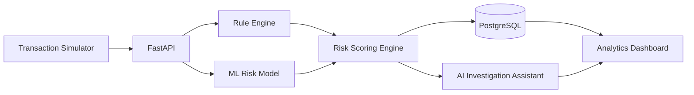

# FraudShield AI - Real-Time Payment Fraud Detection Platform

> Detect, prevent, and explain payment fraud using rule-based detection, machine learning, and AI-powered risk analysis.

[](https://www.python.org/)
[](https://fastapi.tiangolo.com/)
[](LICENSE)
[]()

---

## Overview

Financial institutions lose billions annually to payment fraud. Fraud teams must detect suspicious transactions within milliseconds while minimizing false positives and providing clear explanations for every decision.

**FraudShield AI** is an AI-powered real-time payment fraud detection platform that combines rule-based detection, machine learning, and explainable AI to identify, investigate, and visualize fraudulent payment transactions.

Unlike many fraud detection repositories that focus only on model accuracy, this project is built as a complete product—covering product strategy, system architecture, engineering decisions, and a scalable implementation roadmap.

---

## Key Features

- 💳 Real-Time Transaction Simulator
- ⚡ Rule-Based Fraud Detection Engine
- 🤖 Machine Learning Risk Scoring (XGBoost)
- 🧠 AI Investigation Assistant
- 📊 Interactive Fraud Analytics Dashboard
- 🔍 Risk Scoring & Transaction Insights
- 🌐 REST APIs with FastAPI
- 📚 Product Documentation & Architecture Decisions
- 🚀 Scalable Production Roadmap

---

## Workflow

```text
Payment Transaction
        │
        ▼
Transaction Simulator / API
        │
        ▼
Rule Engine
        │
        ▼
Machine Learning Model
        │
        ▼
Risk Score
        │
        ▼
AI Investigation Assistant
        │
        ▼
Dashboard & Fraud Analytics
```

---

## System Architecture



---

## Technology Stack

| Category | Technology |
|-----------|------------|
| Language | Python 3.11 |
| Backend | FastAPI |
| Machine Learning | XGBoost, Scikit-learn |
| AI | Ollama, Qwen, LangChain *(Planned)* |
| Database | PostgreSQL |
| Dashboard | Streamlit, Plotly |
| Testing | Pytest |
| Containerization | Docker |
| Version Control | Git & GitHub |

---

## Repository Structure

```text
fraudshield-ai/
│
├── app/
│   ├── api/
│   ├── ai/
│   ├── core/
│   ├── dashboard/
│   ├── database/
│   ├── ml/
│   ├── models/
│   ├── rules/
│   ├── simulator/
│   └── utils/
│
├── configs/
├── datasets/
├── docker/
├── docs/
├── tests/
│
├── README.md
├── requirements.txt
└── .gitignore
```

---

## Product Artifacts

| Artifact | Status |
|-----------|--------|
| Product Vision | 🚧 |
| Product Requirements Document (PRD) | 🚧 |
| User Personas | 🚧 |
| Functional Requirements | 🚧 |
| Non-Functional Requirements | 🚧 |
| System Architecture | 🚧 |
| Database Design | 🚧 |
| API Specification | 🚧 |
| Architecture Decision Records | 🚧 |
| Product Roadmap | 🚧 |
| Release Notes | 🚧 |

---

## Development Roadmap

### Phase 1 — Product Design

- [x] Vision
- [x] Problem Statement
- [x] Project Planning
- [x] Product Requirements Document
- [x] Functional Requirements
- [x] Non-Functional Requirements
- [x] System Architecture
- [x] Database Design

### Phase 2 — MVP Development

- [ ] Project Setup
- [ ] Transaction Simulator
- [ ] Rule Engine
- [ ] Risk Scoring Engine
- [ ] ML Fraud Detection Model
- [ ] PostgreSQL Integration
- [ ] FastAPI Backend
- [ ] Dashboard

### Phase 3 — AI Capabilities

- [ ] AI Investigation Assistant
- [ ] Explainable AI
- [ ] Natural Language Fraud Analysis

### Phase 4 — Production Readiness

- [ ] Authentication
- [ ] Role-Based Access Control
- [ ] Docker
- [ ] CI/CD Pipeline
- [ ] Monitoring
- [ ] Cloud Deployment

---

## Key Product Decisions

| Decision | Why |
|-----------|-----|
| Rule Engine + ML | Combines deterministic business rules with predictive analytics for better fraud detection. |
| XGBoost | Industry-proven model for tabular fraud datasets with strong explainability. |
| FastAPI | High-performance asynchronous APIs with automatic OpenAPI documentation. |
| PostgreSQL | Reliable relational database for transaction and fraud case management. |
| Streamlit | Rapid development of operational dashboards for MVP validation. |
| AI Investigation Assistant | Provides human-readable explanations instead of only risk scores. |

---

## Screenshots

> Screenshots and demo videos will be added as the project progresses.

Planned:

- Transaction Simulator
- Fraud Detection Dashboard
- AI Investigation Assistant
- Risk Analytics
- API Documentation

---

## Future Enhancements

- Apache Kafka Streaming
- Redis Caching
- SHAP Explainability
- Feature Store
- Model Monitoring
- Fraud Feedback Loop
- Online Learning
- Kubernetes Deployment
- Multi-region Deployment
- Real-time Alerting
- Email & Slack Notifications

---

## Getting Started

Project setup instructions will be added after the initial implementation is complete.

---

## Contributing

Contributions, suggestions, and feedback are welcome.

If you'd like to improve FraudShield AI, feel free to open an issue or submit a pull request.

---

## License

This project is licensed under the MIT License.

---

## About the Author

**Mautik Patel**

Principal Systems Analyst | AI • Data • Analytics • Product

- 💼 LinkedIn: https://www.linkedin.com/in/mautikpatel/
- 🌐 Portfolio: https://mautikpatel.github.io/
- 💻 GitHub: https://github.com/MautikPatel

---

⭐ **If you find this project interesting, consider giving it a Star!**
